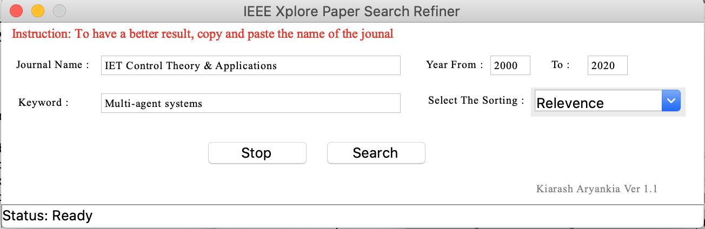
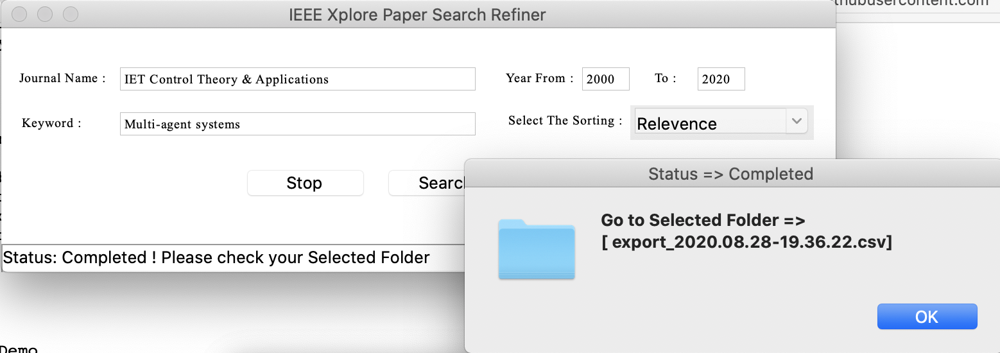

# IEEE_Paper_Search_Refiner

### Application that collect IEEE Papers
This app scrapes the IEEE Xplore website based on four inputs from the user, which operates on Windows and Mac OS.
 
It first opens a browser and inserts the inputs and then collects and delivers an organized CSV output containing the published paper based on the inputs.

This application has a user-friendly graphical user interface that improves the user's experience. Also, it enables the user to put a range for his/her search year, indicate a name of the IEEE journals, and a keyword. The user can follow the information collection process and the status of the program on the application window. This application uses the official IEEE Xplore website and database and retrieves the requested data from the user's input from the IEEE website.

## How it works?

After you run the application you will see this:

And at the end you will a message like this:

## Requirement 

- Python3
- Tkinter
- Selenium

## Future

Moreover, please feel free to give us your feedback to share your experience. 
Finally, I should thank Kianoush (GitHub:@Kianoush-h)  for remarkable debugging and suggestions that helped to develop this application. 

Link: https://www.youtube.com/watch?v=g78Mbcy_l-E

